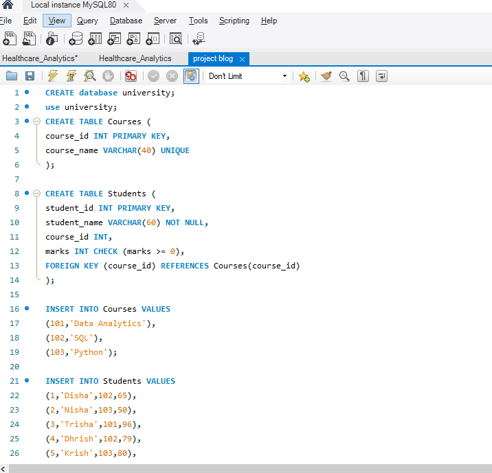
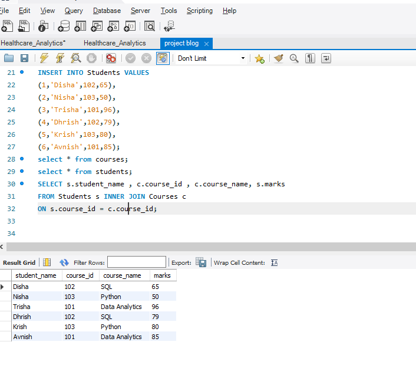

# University Database Management using SQL

This project demonstrates the creation and management of a simple University Database using MySQL. It focuses on database design, relational tables, constraints, and SQL JOIN operations.

---

## Project Objective
The objective of this project is to:
- Create a relational database using SQL
- Establish relationships between tables
- Apply SQL constraints for data integrity
- Perform JOIN operations to retrieve meaningful data

---

## Database Used
**University**

---

## Tables Created

### Courses Table
Stores course-related information.

| Column Name | Data Type | Constraints |
|-------------|-----------|-------------|
| course_id | INT | PRIMARY KEY |
| course_name | VARCHAR(40) | UNIQUE |

---

### Students Table
Stores student details and marks.

| Column Name | Data Type | Constraints |
|-------------|-----------|-------------|
| student_id | INT | PRIMARY KEY |
| student_name | VARCHAR(60) | NOT NULL |
| course_id | INT | FOREIGN KEY |
| marks | INT | CHECK (marks >= 0) |

---

## Project Screenshots

### Database Tables


### JOIN Query Output


## SQL Concepts Used
- CREATE DATABASE
- CREATE TABLE
- PRIMARY KEY
- FOREIGN KEY
- UNIQUE Constraint
- CHECK Constraint
- INSERT INTO
- SELECT Statements
- INNER JOIN

---

## SQL Query Used

```sql
SELECT s.student_name , c.course_id , c.course_name, s.marks
FROM Students s
INNER JOIN Courses c
ON s.course_id = c.course_id;


Tools Used
MySQL
MySQL Workbench
GitHub


Author

Smita Patil
Aspiring Data Analyst | SQL Enthusiast
